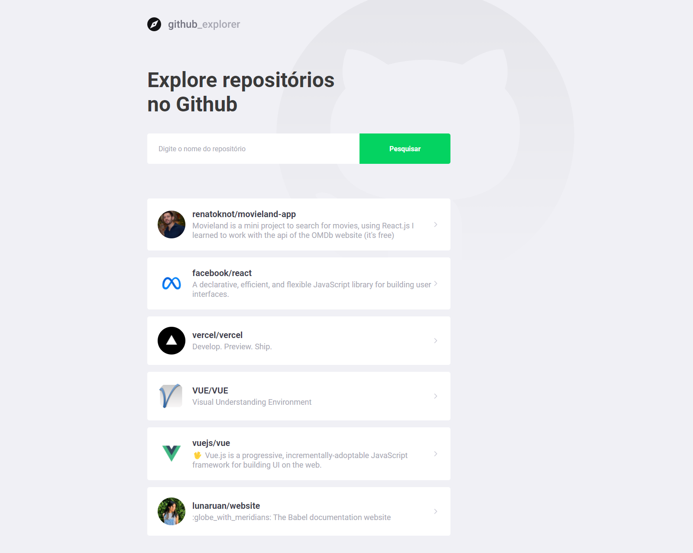

# Desafio **GITHUB API** frontend

Criação de um sistema que possa encontrar usuários no github e ver os detalhes do mesmo. 

Deve ser utilizada a API pública do github para as funcionalidades de pesquisa e detalhes do usuário. Segue a [**documentação**](https://github.com/araya-mentorship/desafio-githubapi-frontend.git) para mais detalhes

Para o desenvolvimento será utilizado o framework **Angular** versão 14.
[**Documentação Angular**](https://angular.io/docs)

Segue uma ideia de layout da página príncipal. Na imagem de exemplo temos um explorador de repositório. No desafio atual queremos a mesma ideia porém para usuários.

___

## **Requisitos**

### Página inicial:
- Deverá conter um campo de busca.
- Listagem com o resultado.
- O resultado deverá conterm a foto de perfil nome e a descrição se tiver a informação.
- [Documentação do endpoint de pesquisa](https://docs.github.com/pt/rest/search#search-users)

### Perfil do usuário:
- O usuário pode acessar um perfil clicando em algum resultado da pesquisa.
- Não existe prototipo para esta tela, você terá a oportunidade de criar um da maneira que você quiser e achar adequada.
- Terá a liberdade de mostrar as informações mais relevantes retornadas.
- [Documentação de informações do usuário](https://docs.github.com/pt/rest/users/users#get-a-user)
___

## **O que será exigido no desafio**:
> :warning: **Importante**: Os pontos a seguir serão questionados no momento da entrega do desafio.

- Organização do código tal como a forma que foi organizado e o motivo de ter feito essa escolha. Organização esperada na escolha de nomenclatura de componentes e pastas e estrutura dos mesmos. A organização do código também será avaliada.
- Abstração da comunicação da aplicação com a API/Serviço (Forma em que será feita as requisições *HTTP* para a API). **Entendimento** de uma API REST e como é feita a comunicação do frontend com outras aplicações e serviços.
- **Testes unitários** com mínimo de **80% de cobertura**. Importante saber o que de fato está sendo testado e se faz sentido para a segurança da aplicação e sua evolução/manutenção.
- Desenvolvimento de layouts baseado em protótipos. Capacidade de criação de desenvovimento de layouts. Conhecimento nas linguagens **CSS** e **HTML**.
- A capacidade de desenvolver soluções pro desafio proposto. A forma do que e o motivo do que foi desenvolvido.
